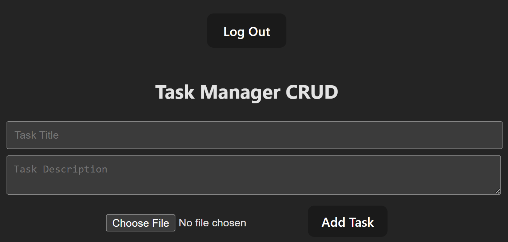
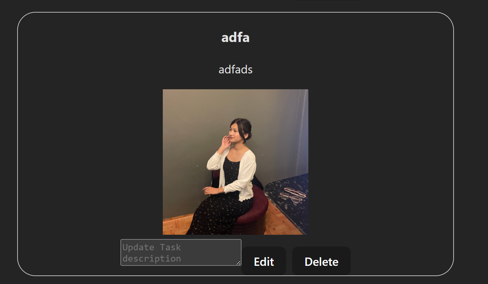

# 📝 Task Manager App (React + Supabase)

A simple **Task Manager** built with **React** and **Supabase**, featuring user authentication, JWT session handling, image uploads, and task CRUD operations.

---

## 🚀 Features
- 🔑 **Authentication**: User signup/signin/signout with **Supabase Auth (JWT session)**.  
- 🖼️ **Image Upload**: Upload images to **Supabase Storage (bucket)** and access them via URL.  
- ✅ **Task Management**: Create, read, update, delete tasks with:  
  - Task Title  
  - Task Description  
  - Task Image  
- ⚡ Built around **Supabase** (backend + auth + storage).  
- 🖥️ Frontend in **React**.  

---

## 📸 Screenshots

### 🔑 Sign In


### 📝 Task CRUD (Add / Edit)


### 📋 Display All Tasks


---

## 🛠️ Tech Stack
- **Frontend**: React, Tailwind CSS (if used)  
- **Backend**: Supabase (Auth, Database, Storage)  
- **Auth**: Supabase JWT sessions  

---

## ⚙️ Installation & Setup

1. **Clone the repo**
   ```bash
   git clone https://github.com/your-username/task-manager-supabase.git
   cd task-manager-supabase
